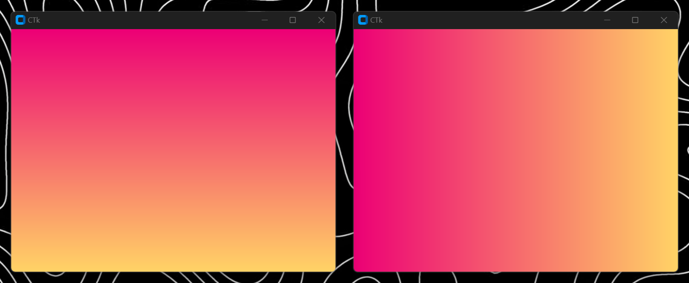

<h3 align="center">
    
</h3>

<h3 align="center">Create a gradient frame for your customtkinter applications.</h3>

<div align="center">
    <a align="center" href="https://pypi.org/project/ctkgradient">
        
    </a>
    <!---
    <a align="center" href="https://pepy.tech/project/ctkgradient">
        
    </a>
    --->
    
</div>

<h3 align="center">
    
</h3>


## CTkGradient
CTkGradient is a fork of [GradientFrame-Tkinter](https://github.com/JeanExtreme002/GradientFrame-Tkinter), it is a python module to create customtkinter frames with a gradient background color of your choice, you can choose between a vertical or horizontal gradient, among other options.

> [!NOTE]
> This project is in alpha state, so you may encounter bugs through its use, which I would recommend reporting in issues. I'm thinking about a few features with gradients like buttons and other widgets, so stay tuned!

## How to use it?
Install the module using `pip` (or `pip3`) by typing the next command on console...
```python
pip install CTkGradient
```

Then import it and use it, here is an example:
```python
# Import customtkinter and CTkGradient
import customtkinter as ctk
import CTkGradient as ctkg

# Initialize CustomTkinter
ctk.set_appearance_mode("dark")
ctk.set_default_color_theme("blue")

root = ctk.CTk()

# Create a GradientFrame with custom colors and direction
gradient_frame = ctkg.GradientFrame(
    master = root,
    colors = ("#ec0075", "#ffd366"),
    direction = "vertical",
    height = 600,
    width = 800
)

gradient_frame.pack(fill = "both")

root.mainloop()
```
